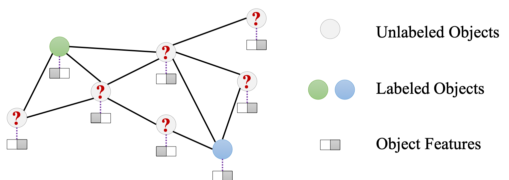
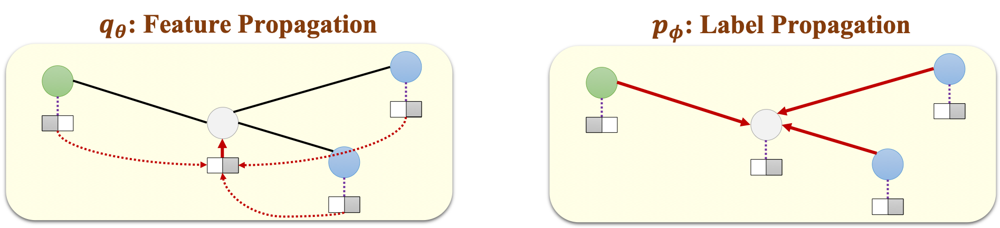
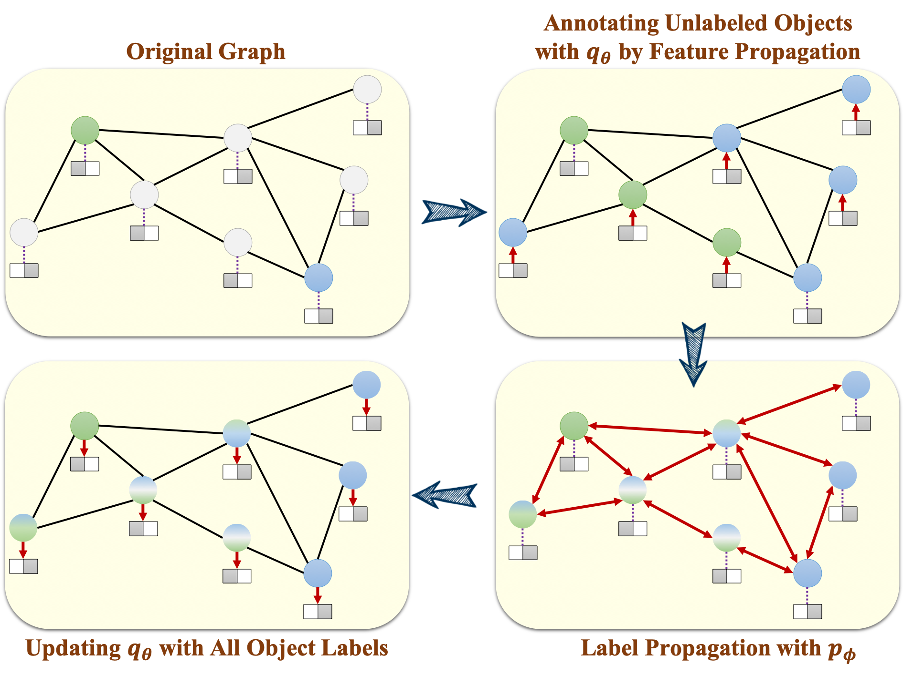
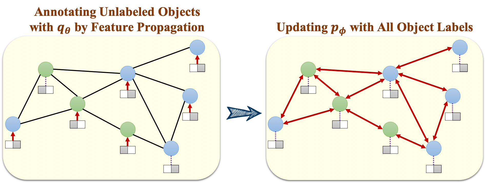

# GMNN
This is an implementation of the [GMNN (Graph Markov Neural Networks)](https://arxiv.org/abs/1905.06214) model.

## Introduction
GMNN integrates **statistical relational learning methods** (e.g., relational Markov networks and Markov logic networks) and **graph neural networks** (e.g., graph convolutional networks and graph attention networks) for semi-supervised object classification. GMNN uses a conditional random field to define the joint distribution of all the object labels conditioned on object features, and the framework can be optimized with a **pseudolikelihood variational EM algorithm**, which alternates between an E-step and M-step. In the E-step, we **infer** the labels of unlabeled objects, and in the M-step, we **learn** the parameters to maximize the pseudolikelihood.

To benefit training such a model, we introduce two graph neural networks in GMNN, i.e., GNNp and GNNq. GNNq is used to improve inference by learning effective object representations through **feature propagation**. GNNp is used to model local label dependency through local **label propagation**. The variational EM algorithm for optimizing GMNN is similar to the **co-training** framework. In the E-step, GNNp annotates unlabeled objects for updating GNNq, and in the M-step, GNNq annotates unlabeled objects for optimizing GNNp.

GMNN can also be applied to many other applications, such as unsupervised node representation learning and link classification. In this repo, we provide codes for both **semi-supervised object classification** and **unsupervised node representation learning**.

## Illustration
### Semi-supervised Object Classification
We focus on the problem of semi-supervised object classification. Given some labeled objects in a graph, we aim at classifying the unlabeled objects.
<p align="left"></p>

### Two Graph Neural Networks
GMNN uses two graph neural networks, one for learning object representations through feature propagation to improve inference, and the other one for modeling local label dependency through label propagation.
<p align="left"></p>

### Optimization
Both GNNs are optimized with the variational EM algorithm, which is similar to the co-training framework.

#### E-Step
<p align="left"></p>

#### M-Step
<p align="left"></p>

## Data
For semi-supervised object classification, we provide the Cora, Citeseer and Pubmed datasets. For unsupervised node representation learning, we provide the Cora and Citeseer datasets. The datasets are constructed by [Yang et al., 2016](https://arxiv.org/abs/1603.08861), and we preprocess the datasets into our format by using the [codes](https://github.com/tkipf/gcn) from Thomas N. Kipf. Users can also use their own datasets by following the format of the provided datasets.

## Usage
The codes for semi-supervised object classification can be found in the folder ```semisupervised```. The implementation corresponds to the variant ```GMNN W/o Attr. in p``` in the Table 2 of the original paper. To run the codes, go to the folder ```semisupervised/codes``` and execute ```python run_cora.py```. Then the program will print the results over 100 runs with seeds 1~100.

The mean accuracy and standard deviation are summarized in the following tables:

| Dataset | Cora | Citeseer | Pubmed |
| --------  |----------|----------|----------| 
| GMNN | 83.4 (0.8) | 73.0 (0.8) | 81.3 (0.5) |

The codes for unsupervised node representation learning are in the folder ```unsupervised```. The implementation corresponds to the variant ```GMNN With q and p``` in the Table 3 of the original paper.  To run the codes, go to the folder ```unsupervised/codes``` and execute ```python run_cora.py```. Then the program will print the results over 50 runs.

The mean accuracy and standard deviation are summarized in the following tables:

| Dataset | Cora | Citeseer |
| --------  |----------|----------|
| GMNN | 82.6 (0.5) | 71.4 (0.5) |

Note that the numbers are slightly different from those in the paper, since we make some changes to the codes before release.

## Acknowledgement
Some codes of the project are from the following repo: [pygcn](https://github.com/tkipf/pygcn).

## Citation
Please cite the following paper if you use the codes of GMNN. Thank you!
```
@inproceedings{qu2019gmnn,
title={GMNN: Graph Markov Neural Networks},
author={Qu, Meng and Bengio, Yoshua and Tang, Jian},
booktitle={International Conference on Machine Learning},
pages={5241--5250},
year={2019}
}
```


